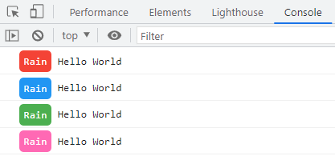

# custom console.log style

**English** | [中文](./README.zh_CN.md)

## Introduction

`babel-plugin-custom-console-style` is a babel plugin that changes the output style of `console.log`

## Installation

```bash
npm i babel-plugin-custom-console-style -D
```

## Config
### babel.config.js
```js
module.exports = {
  plugins: [
    "custom-console-style"
  ]
};


//or pass in the custom style
module.exports = {
  plugins: [
    [
      "custom-console-style", 
      { 
        themeStyle: {
          yellow:{
            background: "#ffff33",
            color: "#000",
            border: "1px solid red"
          }
        }
      }
    ]
  ]
};
```

### .babelrc
```
{
  "plugins": [
    "custom-console-style"
  ]
}

//or pass in the custom style
{
  "plugins": [
    [
      "custom-console-style", 
      { 
        "themeStyle": {
          "yellow":{
            "background": "#ffff33",
            "color": "#000",
            "border": "1px solid red"
          }
        }
      }
    ]
  ]
}
```

## Use examples
By adding the comment `//test|red` after the console.log(), `test` is the precursor to applying the custom style, and `red` means using the red theme, splitting by `|`, passing the settings to the plugin

```js
console.log("Hello World")//Rain|red

console.log("Hello World")//Rain|blue

console.log("Hello World")//Rain|green

console.log("Hello World")//Rain|pink
```
**View in the console**

## Theme
### Default theme
```js
const defaultStyle = {
  background: "#4caf50",
  color: "white",
  padding: "5px",
  "border-radius": "5px"
}

const customThemeStyle = {
  red: {
    background: "#f44336"
  },
  green: {
    background: "#4caf50"
  },
  blue: {
    background: "#2196f3"
  },
  pink: {
    background: "#ff69b4"
  }
}
```
### Custom themes
Pass in the following configuration
```js
{
  themeStyle:{
    yellow:{
      background: "#ffff33",
      color: "#000",
      border: "1px solid red"
    },
    black:{
      background: "#000",
      color: "green"
    }
  }
}
```

Use a custom configuration
```js
console.log("Hello World")//Rain|yellow

console.log("Hello World")//Rain|black
```

**View in the console**


## In the end

If you want to add your own theme color, please contact me