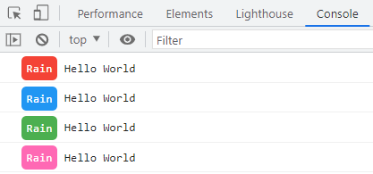
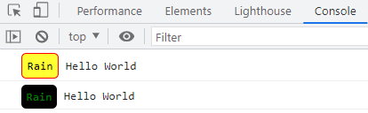

# 自定义console.log样式

**中文** | [English](./README.md)

## 简介

`babel-plugin-custom-console-style`是一个可以改变`console.log`输出样式的babel插件

## 安装

```bash
npm i babel-plugin-custom-console-style -D
```

## 配置
### babel.config.js
```js
module.exports = {
  plugins: [
    "custom-console-style"
  ]
};


//or传入自定义的样式
module.exports = {
  plugins: [
    [
      "custom-console-style", 
      { 
        themeStyle: {
          yellow:{
            background: "#ffff33",
            color: "#000",
            border: "1px solid red"
          }
        }
      }
    ]
  ]
};
```

### .babelrc
```
{
  "plugins": [
    "custom-console-style"
  ]
}

//or传入自定义配置
{
  "plugins": [
    [
      "custom-console-style", 
      { 
        "themeStyle": {
          "yellow":{
            "background": "#ffff33",
            "color": "#000",
            "border": "1px solid red"
          }
        }
      }
    ]
  ]
}
```

## 使用示例
通过在console.log()后加上注释`//test|red`, `test`是会应用自定义样式的前辍, `red`表示使用red主题, 通过`|`分割, 将设置传递给plugin

```js
console.log("Hello World")//Rain|red

console.log("Hello World")//Rain|blue

console.log("Hello World")//Rain|green

console.log("Hello World")//Rain|pink
```

**在控制台查看**

## 主题
### 默认主题
```js
const defaultStyle = {
  background: "#4caf50",
  color: "white",
  padding: "5px",
  "border-radius": "5px"
}

const customThemeStyle = {
  red: {
    background: "#f44336"
  },
  green: {
    background: "#4caf50"
  },
  blue: {
    background: "#2196f3"
  },
  pink: {
    background: "#ff69b4"
  }
}
```
### 自定义主题
传入以下配置
```js
{
  themeStyle:{
    yellow:{
      background: "#ffff33",
      color: "#000",
      border: "1px solid red"
    },
    black:{
      background: "#000",
      color: "green"
    }
  }
}
```

使用自定义配置
```js
console.log("Hello World")//Rain|yellow

console.log("Hello World")//Rain|black
```

**在控制台查看**


## 最后

如果你想添加自己的主题颜色，请联系我
